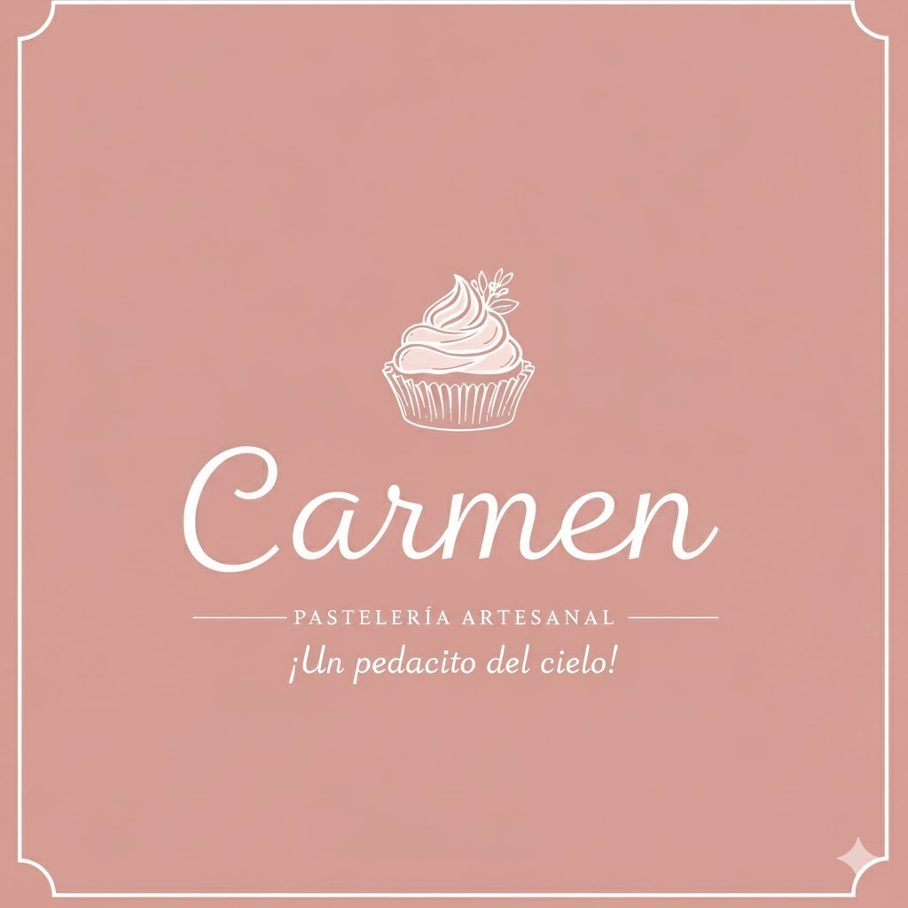

# sis457_pasteleria - Sistema de Gestión de Ventas para la Pastelería "Carmen"

    

## 🍰 Descripción del Proyecto

Este proyecto consiste en el desarrollo de un **Sistema de Gestión de Ventas/Pedidos** diseñado específicamente para la pastelería **"Carmen, ¡Un pedacito del cielo!"**.

La pastelería opera bajo un modelo de venta remota y por encargo, sin una tienda física para compra inmediata.

El sistema está orientado a facilitar la **venta y gestión de pedidos** de su catálogo de productos: pasteles, tartas, pies y cupcakes.

---

## 💻 Arquitectura del Sistema

El sistema implementa una arquitectura de **3 capas** para una separación clara de responsabilidades:

1.  **`CadPasteleria`** (Capa de Acceso a Datos - CAD): Se encarga de la comunicación directa con la base de datos.
2.  **`ClnPasteleria`** (Capa Lógica de Negocio - CLN): Contiene toda la lógica de negocio y las reglas del sistema.
3.  **`CpPasteleria`** (Capa de Presentación - CPN): Es una **Aplicación de Escritorio** (Desktop App) que sirve como interfaz para el usuario.

### 🎯 Funcionalidad Principal

La funcionalidad central y de mayor prioridad es el **Registro de Ventas**.

---

## 📋 Entidades y Relaciones

El modelo de datos se basa en las siguientes entidades clave:

| Entidad | Propósito | Campos Clave (CRUD) | Eliminación Lógica | Observaciones |
| :--- | :--- | :--- | :--- | :--- |
| **Usuario** | Autenticación y Login al sistema. | `idUsuario`, `nombreUsuario`, `clave`, `rol` | **Sí** (`Estado`) | |
| **Producto** | Catálogo de pastelería disponible para la venta. | `idProducto`, `nombre`, `precioUnitario`, `tipoProducto`, `descripcion` | **Sí** (`Estado`) | |
| **Cliente** | Contactos para la gestión de pedidos. | `idCliente`, `nombreCompleto`, `telefono`, `email`, `direccion` | **Sí** (`Estado`) | **CRUD de Alta Prioridad.** |
| **Proveedor** | Entidades que suministran materia prima. | `idProveedor`, `nombre`, `telefono`, `email`, `direccion` | **Sí** (`Estado`) | **CRUD de Alta Prioridad.** |
| **Pedido** | Cabecera de la transacción de venta. | `idPedido`, `fechaEntrega`, `total`, `idCliente`, `idUsuario` | **No** | Registro Histórico. |
| **DetallePedido** | Detalle de los productos incluidos en cada pedido. | `idDetallePedido`, `idPedido`, `idProducto`, `cantidad` | **No** | Detalle de Registro. |

---

## 📅 Cronograma de Hitos

Este es el plan de trabajo con las fechas límite para cada hito:

| Hito | Fecha Límite | Tarea a Completar | Estado |
| :--- | :--- | :--- | :--- |
| **1** | **06/10/2025** | Creación de Repositorio y `README.md`. | ✔️ Completado |
| **2** | **13/10/2025** | Implementación de la Capa de Acceso a Datos (CAD) y consolidación de la estructura de las entidades. | En progreso | Pendiente |
| **3** | **20/10/2025** | Implementación de la Capa Lógica de Negocios (CLN) y diseño inicial de interfaces (Menú, Vistas de CRUD). | Pendiente |
| **4** | **27/10/2025** | CRUD completo de las entidades **Producto** y **Cliente**. Login funcional y Menú Principal implementados. | Pendiente |
| **5** | **03/11/2025** | Funcionalidad de **Pedido/Venta** inicial. | Pendiente |
| **6** | **10/11/2025** | Refinación y pruebas de la funcionalidad de **Pedido/Venta** y Documentación inicial del proyecto. | Pendiente |
| **7** | **17/11/2025** | **Presentación final** del laboratorio. | Pendiente |
